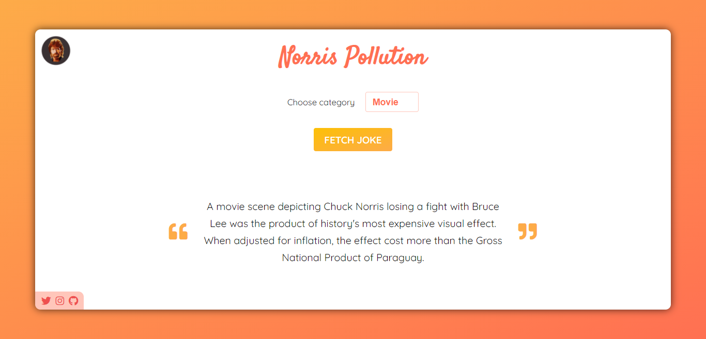

# Norris Pollution

## By [Sunil Shastry](https://www.sunilshastry.com/ "Sunil Shastry").

---

_**Norris Pollution** is a simple and fun web application that provides you with a range of humorous jokes about & made by Chuck Norris._

---

### How to use?

- Access the website by visiting [Norris Pollution](https://norrispollution.netlify.app/ "Norris Pollution").

- When the web application is fully loaded, you will have a variety of options to chose from, for the category of the joke.

- You have exactly 16 categories to chose from, click the category option button to view all options.

- After setting your desired option, please click on the "Fetch Joke" button and the application will do it's task in fetching the joke under the given criteria.

- New joke is generated each time the "Fetch Joke" button is clicked.

- On hovering the joke, a new popup is generated which says "Copy Joke". Click the joke in order to copy it to your clipboard.

- If the application does not load any content, please do not worry. The application will automatically provide you with a notification that states the status of the application. Simply reload the browser to fix the issue.

> DISCLAIMER: This is a fun and educative based project built from a third party API. No offence is intended to any individual or organization. If a joke is found abusive, please ignore it.

---

### **Credits & Shoutouts**

Credit to [Chuck Norris API](https://api.chucknorris.io/) for the reliable, secure, fast and free API for the Norris Pollution project.

---

### **Want to know more about me?**

_If you wish to know more about me and the projects I've developed and designed, or simply contact me for any queries:_

Visit my [Portfolio Website](https://www.sunilshastry.com/ "Portfolio").

or, contact me on [Twitter](https://twitter.com/sunillshastry/ "Sunil on Twitter").

**Thank you for visiting my GitHub repository, have a great day!**
